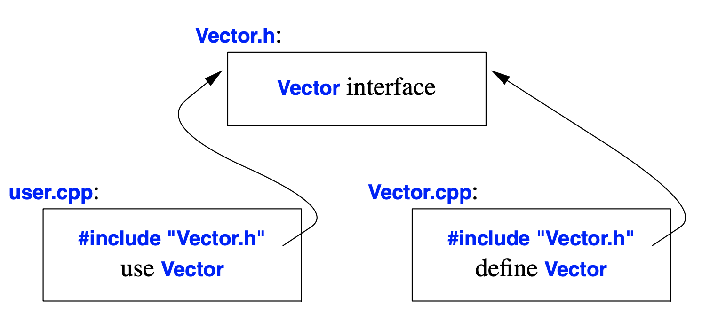

# C++ Note

> You don’t have to know every detail of C++ to write good programs.
> Focus on programming techniques, not on language features.
```cpp
// to iterate over an iterable
// lets say v is an array
for(auto x : v){
    // some tasks 
}

/* if want to create the iterating variable without copying
the orginal data. we can pass x by reference */
for(auto& x : v){
    // some tasks
}
```

### Pass-by-reference
it is like passing the alias of the data at the arguments

```cpp
// avoid copying the passing data

void sort(vector<double>& v);

/* don't want to modify the arguments, also don't want to 
copy it */
double sum(const vector<double>& v);
```
## User-Defined Types

- **structure `struct`**

```cpp
// basic structure
struct Vector{
    int sz;
    double* elem;
}

// however, elem points to nothing, so we have to initialize it
void vector_init(Vector& v, int s){
    v.elem = new double[s];
    v.sz = s;
}

// The following demonstrate how to access `struct` member
void f(Vector r, Vector& rv, Vector* pv){
    int i1 = r.sz;
    int i2 = rv.sz;  // access through reference
    int i3 = pv->sz; // access through pointer
}
// reference is like a nickname, though different name, but the same person
```
- **Class**

Notice that regardless of the number of elements of each object, 
all the objects are of the same size (i.e. taking up the same size of space) 
```cpp
class Vector{
    public:
        Vector(int s): elem{new double[s]}, sz{s}{} // constructor
        // the part before {} is called memeber initializer list
        // TODO
    private:
        double* elem;
        int sz;
        // TODO
}
```
_A struct is simply a class with its members public by default_\
Notice that you can also define constructor and member function for `struct` objects.

- **Union**

The purpose of union is to save memory by using the same memory region for storing different objects at different times.\
That is the same class might have some subtypes, which can effect the type of clas member it uses.\

Use "naked"`union` can easily produce errors due to the confusion of types. use _tagged union_\

```cpp
enum Type{ str, num};

struct Entry{
    Type t;
    char* s; // if type is str
    int i; // if type is num
}; 

void f(Entry* p ){
    if(p->t == str){
        // do something on p->s
    }
    if(p->t == num){
        // do something on p->i
    }
}
// the above can be improved by:
union Value{ // all member share the same memory space and does't exist at the same time
    char* s;
    int i;
};

struct Entry{
    Type t;
    Value v;
};

void f(Entry* p){
    if(p->t == str){
        // do on p->v.s
    }
    if(p->t == num){
        // do on p->v.i
    }
}
```
- **Enumeration**

    1. `enum class`

    2. plain `enum`

In `enum class`, the variables are in a local scope of enum class. However, for plain `enum`,  those variables are in the same scope of `enum` name.

```cpp
// Error, cuz redefinition of variables
enum TrainLight{
    red,
    blue,
    pink
};
enum TrafficLight{
    red,
    blue,
    pink
};

// better use enum class
// No error
enum class TrainLight{
    red,
    blue,
    pink
};
enum class TrafficLight{
    red,
    blue,
    pink
};
```
Define operation for enumerations is recommended. Also, `enumeration class` is preferred over plain `enum`.

## Modularity

- **Separate compliation**


- **Error handling**

```cpp
class Error{};

void f(){
    // some tasks...
    // if error happens, throw something
    // it's like a error version of return. you can throw anything
    throw Error
}

int main(){
    try{
        f(); // call f()
    }
    catch(Error){
        // if 'Error' is thrown, do the following
        // some tasks...
    } // so that the program will not directly terminated when Error happens
}
```
You can do error handling at any level. However, when working in a large project, you might not
know if the provided function does error handling inside, so that you don't have do it.

`noexcept` is a way to tell others that you have done error handling inside, so others don't have to catch anything (i.e. nothing will be thrown)

```cpp 
void f() noexcept{
    // TODO
}
// if an error is still thrown though declared noexcept, program will terminate with error
```

- **Invariant**

    The invariant of a function or class is its predefinition. For example, when we write a customized `Vector`, we would assume that the index should be an non-negative integer. Then this assumption is the invariant of Vector class.

```cpp
Vector::Vector(int s){
    if(s<0) throw length_error{};
    // TODO
}
```
However, sometimes it is preferable to check these assumptions while in the compile time. This is when the static assertion comes in.

- **Static Assertion**

    To check something in the compile time you can simply call `static_assert(A, S)`. This means that if `A` is not satisfied, it will print compile error message `S`.

   ```cpp
        static_assert(4<sizeof(int), "interger space is too small");
   ```
    _Be aware that you can only check the const expression with static assertions!!_

## Classes

- Concrete tpye


### constant member function

A constant member function can be accessed by both constant or non-constant object. But a non-constant member function can only be accessed by non-constant function. 

Think about the following scenario: when you want your object to be a constant, you wouldn't want the data inside that object to be change by any of its member function. Thus, to protect the data inside, such as read(), you can only call the member function that is declared `const`. 

```cpp 
class Test{
    private:
        // todo
    public:
        // todo
        int getValue() const; // const Test can call
        void writeValue(int x); // const Test cannot call 
};

int main(){
    const Test t;
    int a = t.getValue(); // OK
    t.writeValue(10); // Error: writeValue is not a const memebr function
}
```

- **Container**

Container is an object that stores a collection of objects inside, for example `Vector`.

- **Destructor**

If allocating memory with `new`, when the data is no longer needed, it should be deallocated. Otherwise, there will be space wasted

```cpp 
class Vector{
    private:
        double* elem;
        int sz;
    public:
        Vector(int s): elem{new double[s]}, sz{s}{
            for(int i = 0; i!=s; i++){
                elem[i] = 0;
            }
        }
        
        ~Vector(){delete[] elem;}     
        double& operator[](int i);
        int size(); 
}; 
```
The way destructor is called is as follow:

```cpp
void f(int n){
    Vector v1(n);
    
    // use v1
    
    {
        Vector v2(2*n);
        // use v2
    } // v2 is destroyed
    
    // use v1
}// v1 is destroyed
```

