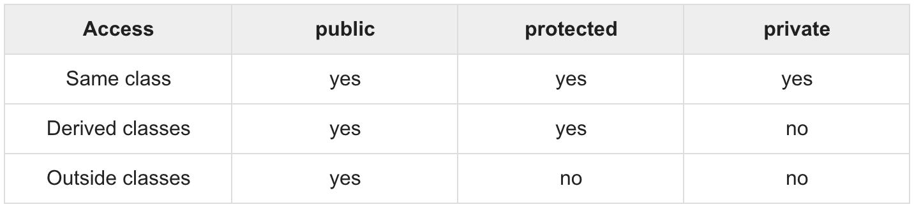

# Inheritance

The parent class is called base class or super class. The child class is called derived class.

- **Accessibility**

    <p align="center">
        
    </p>

- **Type of Interface**

    A class can be derived from multiple classes.
    
    ```cpp
    // format
    // class derived_class : access baseA, access baseB, access baseC
    class Rectangle: public Shape, public Paint_cost{//TODO};
    ```
